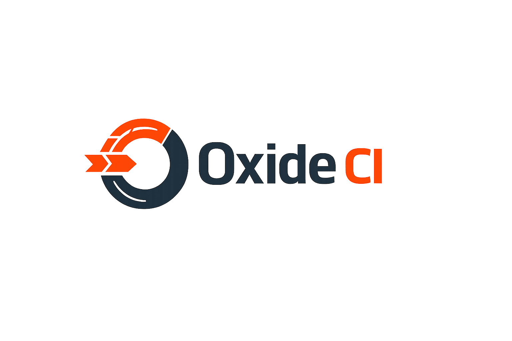

<div align="center">



# Oxide CI

**A Modern, Extensible, High-Performance CI/CD Engine written in Rust.**

> [!WARNING]
> **Status: Early Development (v0.1.0)**
> This project is currently in early alpha. Features and APIs are subject to change. Use with caution in production environments.

[](https://github.com/copyleftdev/oxide-ci/actions)
[](LICENSE)
[](https://www.rust-lang.org)
[](https://github.com/copyleftdev/oxide-ci/wiki)

---

</div>

Oxide CI is designed to solve the complexity and slowness of modern CI systems. It provides a local-first, dogfooding-capable pipeline engine with a powerful plugin system.

## 🚀 Key Features

| Feature | Description |
|---------|-------------|
| **⚡ Blazing Fast** | Built with Rust and Tokio for high-concurrency execution. |
| **🔌 Plug & Play** | Extend functionality with **Native** and **WASM** plugins. |
| **🐶 Dogfooding** | Capable of building, testing, and verifying itself locally. |
| **🛠️ Compatibility** | Drop-in replacements for common GitHub Actions. |

## 📦 quick start

```bash
# Install CLI
cargo install --path crates/oxide-cli

# Run a pipeline
oxide run .oxide-ci/pipeline.yaml
```

## 🎨 Architecture

Oxide CI functions via a modular architecture:
- **Core**: Shared logic and event bus.
- **Agent**: Distributed execution workers.
- **Scheduler**: DAG resolution and job dispatch.

## 🤝 Contributing

We welcome contributions! Please see our [Contributing Guide](CONTRIBUTING.md).

---
<div align="center">
<sub>Built with 🧡 by <a href="https://github.com/copyleftdev">Copyleft Dev</a></sub>
</div>
