<div align="center">


**A Modern, Extensible, High-Performance CI/CD Engine written in Rust.**

> [!WARNING]
> **Status: Early Development ([v0.1.0](https://github.com/copyleftdev/oxide-ci/releases/tag/v0.1.0))**
> This project is currently in early alpha. Features and APIs are subject to change. Use with caution in production environments.

[](LICENSE)
[](https://www.rust-lang.org)
[](https://doc.rust-lang.org/edition-guide/)
[](https://github.com/copyleftdev/oxide-ci/wiki)

<p align="center"><a href="https://tokentip.to/@copyleftdev"></a></p>

---

</div>

Oxide CI is designed to solve the complexity and slowness of modern CI systems. It provides a local-first, dogfooding-capable pipeline engine with a powerful plugin system.

## 🚀 Key Features

| Feature | Description |
|---------|-------------|
| **⚡ Blazing Fast** | Built with Rust and Tokio for high-concurrency execution. |
| **🔌 Plug & Play** | Extend functionality with **Native** and **WASM** plugins, referenced as `uses: name@v1`. |
| **🐶 Dogfooding** | Capable of building, testing, and verifying itself locally. |
| **🛠️ Compatibility** | Drop-in replacements for common GitHub Actions. |
| **🌐 Distributed** | An HTTP API, a scheduler, and agents coordinating over NATS — or none of it, and just run a pipeline locally. |

## 📦 Quick start

Run a pipeline with nothing but the CLI:

```bash
cargo install --path crates/oxide-cli   # not yet on crates.io
oxide run .oxide-ci/pipeline.yaml
```

Or bring up the whole engine — API, scheduler, agent — and watch a run travel through it:

```bash
make dev-up      # Postgres and NATS in containers, services native
make dev-smoke   # creates a pipeline, runs it, proves it reached an agent
make dev-down
```

`make stack-up` runs the same thing entirely in Docker. See
[Local Development](docs/src/development.md) for the difference and when each is
worth using.

## 🎨 Architecture

Hexagonal: `oxide-core` owns the domain and declares ports as traits; adapters
implement them and hold no business logic. Dependencies point inward — no
adapter name appears anywhere in `oxide-core`, which is the property worth
protecting.

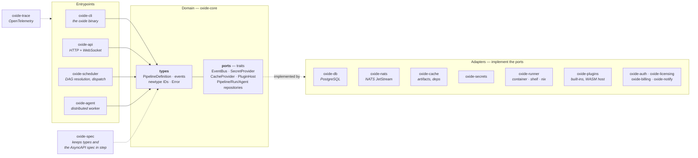
```mermaid
flowchart LR
    subgraph entry["Entrypoints"]
        direction TB
        cli["oxide-cli<br/><i>the oxide binary</i>"]
        api["oxide-api<br/><i>HTTP + WebSocket</i>"]
        sched["oxide-scheduler<br/><i>DAG resolution, dispatch</i>"]
        agent["oxide-agent<br/><i>distributed worker</i>"]
    end

    subgraph domain["Domain — oxide-core"]
        direction TB
        types["<b>types</b><br/>PipelineDefinition · events<br/>newtype IDs · Error"]
        ports["<b>ports</b> — traits<br/>EventBus · SecretProvider<br/>CacheProvider · PluginHost<br/>Pipeline/Run/Agent repositories"]
    end

    subgraph adapters["Adapters — implement the ports"]
        direction TB
        db["oxide-db<br/><i>PostgreSQL</i>"]
        nats["oxide-nats<br/><i>NATS JetStream</i>"]
        cache["oxide-cache<br/><i>artifacts, deps</i>"]
        secrets["oxide-secrets"]
        runner["oxide-runner<br/><i>container · shell · nix</i>"]
        plugins["oxide-plugins<br/><i>built-ins, WASM host</i>"]
        commercial["oxide-auth · oxide-licensing<br/>oxide-billing · oxide-notify"]
    end

    cli --> types
    api --> types
    sched --> types
    agent --> types

    types --- ports
    ports -.->|implemented by| adapters

    spec["oxide-spec<br/><i>keeps types and<br/>the AsyncAPI spec in step</i>"] -.-> types
    trace["oxide-trace<br/><i>OpenTelemetry</i>"] -.-> entry
```

## 🔀 How a run travels the system

Each hop is a separate process, which is worth knowing when one stalls.

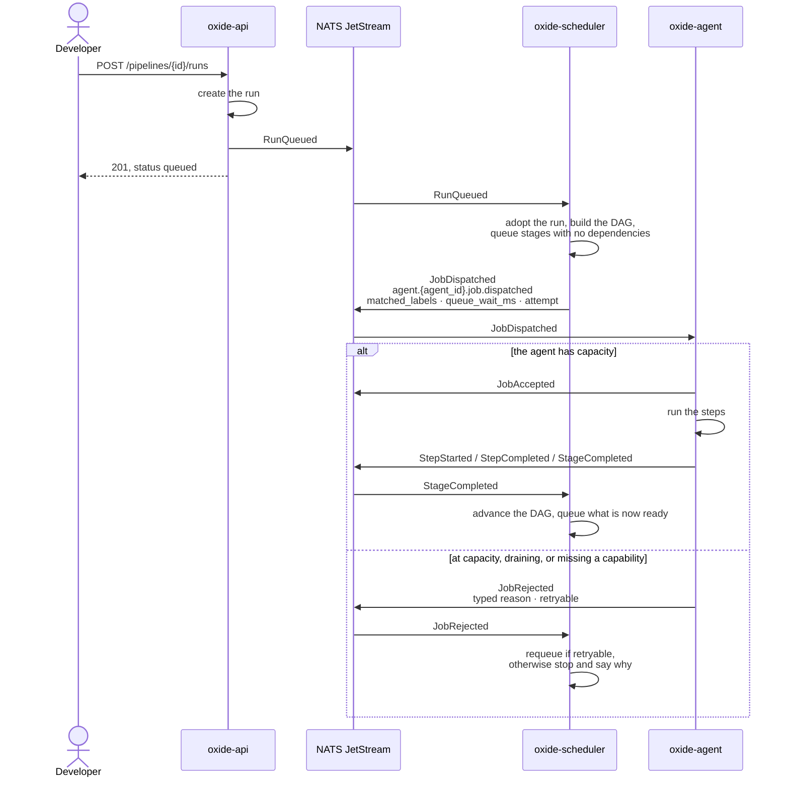
```mermaid
sequenceDiagram
    actor dev as Developer
    participant api as oxide-api
    participant bus as NATS JetStream
    participant sched as oxide-scheduler
    participant agent as oxide-agent

    dev->>api: POST /pipelines/{id}/runs
    api->>api: create the run
    api->>bus: RunQueued
    api-->>dev: 201, status queued

    bus->>sched: RunQueued
    sched->>sched: adopt the run, build the DAG,<br/>queue stages with no dependencies
    sched->>bus: JobDispatched<br/>agent.{agent_id}.job.dispatched<br/>matched_labels · queue_wait_ms · attempt
    bus->>agent: JobDispatched

    alt the agent has capacity
        agent->>bus: JobAccepted
        agent->>agent: run the steps
        agent->>bus: StepStarted / StepCompleted / StageCompleted
        bus->>sched: StageCompleted
        sched->>sched: advance the DAG, queue what is now ready
    else at capacity, draining, or missing a capability
        agent->>bus: JobRejected<br/>typed reason · retryable
        bus->>sched: JobRejected
        sched->>sched: requeue if retryable,<br/>otherwise stop and say why
    end
```

A run stuck in `queued` is almost always the second hop or the third: no
scheduler running, or no agent whose labels match. `make dev-status` answers the
first, `GET /api/v1/agents` the second.

<details>
<summary><b>More diagrams</b> — plugin resolution, secrets, spec correlation, event flow</summary>

### Resolving a `uses:` reference

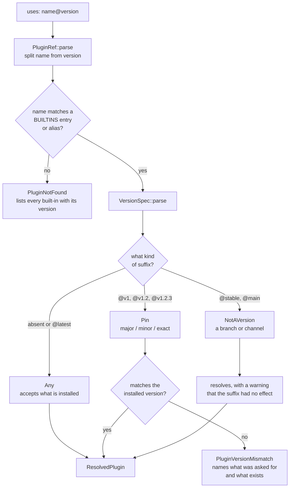
```mermaid
flowchart TD
    ref["uses: name@version"] --> parse["PluginRef::parse<br/>split name from version"]
    parse --> lookup{"name matches a<br/>BUILTINS entry<br/>or alias?"}
    lookup -->|no| notfound["PluginNotFound<br/>lists every built-in with its version"]
    lookup -->|yes| vspec["VersionSpec::parse"]

    vspec --> kind{"what kind<br/>of suffix?"}
    kind -->|"absent or @latest"| any["Any<br/>accepts what is installed"]
    kind -->|"@v1, @v1.2, @v1.2.3"| pin["Pin<br/>major / minor / exact"]
    kind -->|"@stable, @main"| notver["NotAVersion<br/>a branch or channel"]

    any --> resolved
    pin --> match{"matches the<br/>installed version?"}
    match -->|yes| resolved["ResolvedPlugin"]
    match -->|no| mismatch["PluginVersionMismatch<br/>names what was asked for<br/>and what exists"]
    notver --> warn["resolves, with a warning<br/>that the suffix had no effect"]
    warn --> resolved
```

`@stable` is a branch name, not a version. Failing it would break pipelines
ported from GitHub Actions; ignoring it silently is what caused
[#50](https://github.com/copyleftdev/oxide-ci/issues/50). So it runs and says so.

### Secrets, and where they get masked

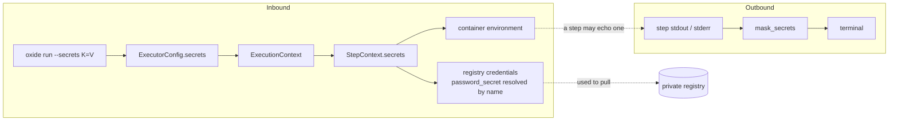
```mermaid
flowchart LR
    subgraph inbound["Inbound"]
        flag["oxide run --secrets K=V"] --> cfg["ExecutorConfig.secrets"]
        cfg --> ectx["ExecutionContext"]
        ectx --> sctx["StepContext.secrets"]
        sctx --> env["container environment"]
        sctx --> creds["registry credentials<br/>password_secret resolved by name"]
    end

    subgraph outbound["Outbound"]
        stdout["step stdout / stderr"] --> mask["mask_secrets"]
        mask --> term["terminal"]
    end

    env -.->|"a step may echo one"| stdout
    creds -.->|"used to pull"| registry[("private registry")]
```

### Spec and code, kept in agreement

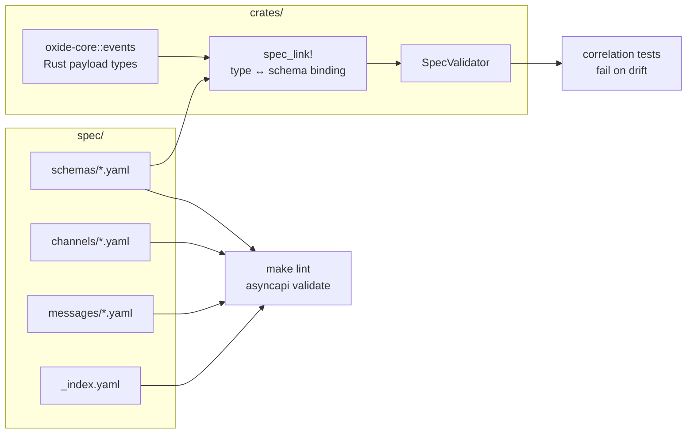
```mermaid
flowchart LR
    subgraph specside["spec/"]
        schema["schemas/*.yaml"]
        channel["channels/*.yaml"]
        message["messages/*.yaml"]
        index["_index.yaml"]
    end

    subgraph codeside["crates/"]
        types["oxide-core::events<br/>Rust payload types"]
        link["spec_link!<br/>type ↔ schema binding"]
        validator["SpecValidator"]
    end

    schema --> link
    types --> link
    link --> validator
    validator --> test["correlation tests<br/>fail on drift"]
    schema --> lint["make lint<br/>asyncapi validate"]
    channel --> lint
    message --> lint
    index --> lint
```

### Event flow at runtime

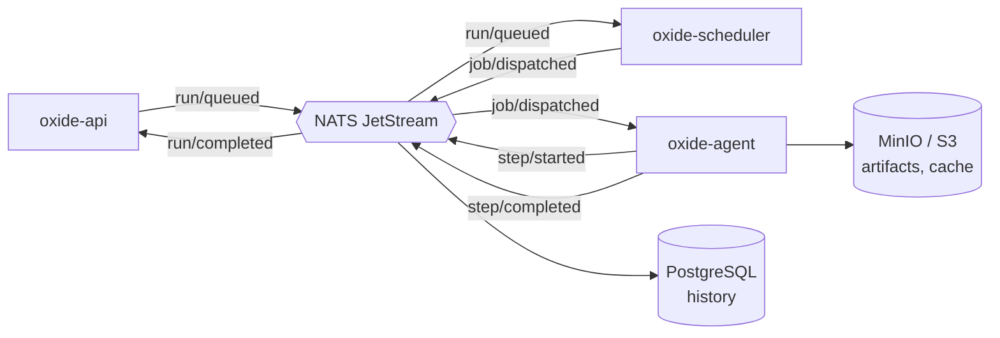
```mermaid
flowchart LR
    api["oxide-api"] -->|run/queued| bus{{"NATS JetStream"}}
    bus -->|run/queued| sched["oxide-scheduler"]
    sched -->|job/dispatched| bus
    bus -->|job/dispatched| agent["oxide-agent"]
    agent -->|step/started| bus
    agent -->|step/completed| bus
    bus -->|run/completed| api
    bus --> db[("PostgreSQL<br/>history")]
    agent --> cache[("MinIO / S3<br/>artifacts, cache")]
```

### A local run, step by step

The path `oxide run` takes, with no server involved.

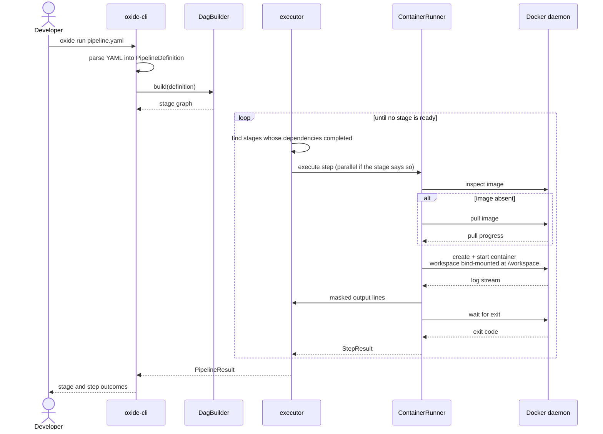
```mermaid
sequenceDiagram
    actor dev as Developer
    participant cli as oxide-cli
    participant dag as DagBuilder
    participant exec as executor
    participant run as ContainerRunner
    participant docker as Docker daemon

    dev->>cli: oxide run pipeline.yaml
    cli->>cli: parse YAML into PipelineDefinition
    cli->>dag: build(definition)
    dag-->>cli: stage graph
    loop until no stage is ready
        exec->>exec: find stages whose dependencies completed
        exec->>run: execute step (parallel if the stage says so)
        run->>docker: inspect image
        alt image absent
            run->>docker: pull image
            docker-->>run: pull progress
        end
        run->>docker: create + start container<br/>workspace bind-mounted at /workspace
        docker-->>run: log stream
        run->>exec: masked output lines
        run->>docker: wait for exit
        docker-->>run: exit code
        run-->>exec: StepResult
    end
    exec-->>cli: PipelineResult
    cli-->>dev: stage and step outcomes
```

</details>

## 🧪 Testing

Four tiers, separated by one question: **what is allowed to turn the gate red?**
A gate that fails for reasons outside the repository trains people to ignore it,
so the tiers that block are exactly the tiers that are hermetic.

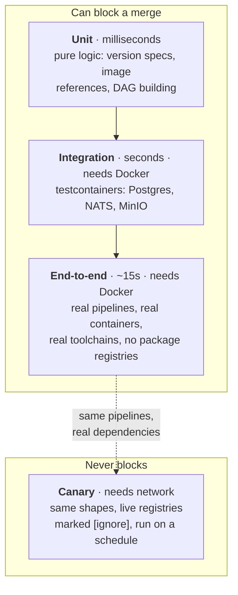
```mermaid
flowchart TB
    subgraph blocking["Can block a merge"]
        unit["<b>Unit</b> · milliseconds<br/>pure logic: version specs, image<br/>references, DAG building"]
        integ["<b>Integration</b> · seconds · needs Docker<br/>testcontainers: Postgres, NATS, MinIO"]
        e2e["<b>End-to-end</b> · ~15s · needs Docker<br/>real pipelines, real containers,<br/>real toolchains, no package registries"]
    end

    subgraph nonblocking["Never blocks"]
        canary["<b>Canary</b> · needs network<br/>same shapes, live registries<br/>marked #91;ignore#93;, run on a schedule"]
    end

    unit --> integ --> e2e -.->|"same pipelines,<br/>real dependencies"| canary
```

<details>
<summary><b>More on testing</b> — coverage map, gate sequence, mutation discipline</summary>

### What the end-to-end tier covers

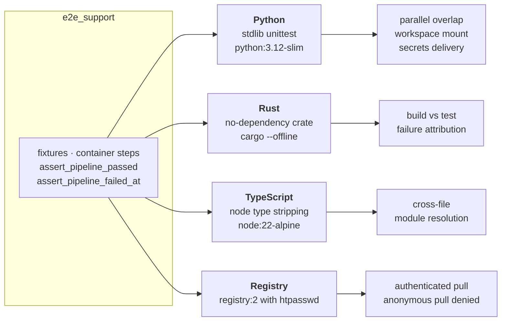
```mermaid
flowchart LR
    subgraph shared["e2e_support"]
        harness["fixtures · container steps<br/>assert_pipeline_passed<br/>assert_pipeline_failed_at"]
    end

    harness --> py["<b>Python</b><br/>stdlib unittest<br/>python:3.12-slim"]
    harness --> rs["<b>Rust</b><br/>no-dependency crate<br/>cargo --offline"]
    harness --> ts["<b>TypeScript</b><br/>node type stripping<br/>node:22-alpine"]
    harness --> reg["<b>Registry</b><br/>registry:2 with htpasswd"]

    py --> pyc["parallel overlap<br/>workspace mount<br/>secrets delivery"]
    rs --> rsc["build vs test<br/>failure attribution"]
    ts --> tsc["cross-file<br/>module resolution"]
    reg --> regc["authenticated pull<br/>anonymous pull denied"]
```

### Every negative test is mutation-tested

A test that cannot fail is worse than no test, because it reports safety it does
not provide.

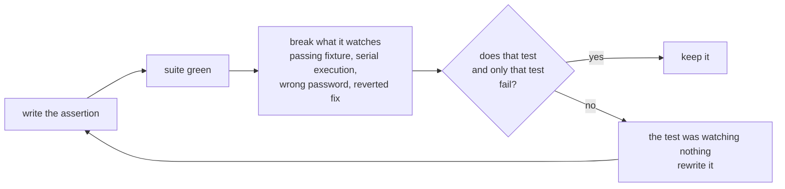
```mermaid
flowchart LR
    write["write the assertion"] --> green["suite green"]
    green --> mutate["break what it watches<br/>passing fixture, serial execution,<br/>wrong password, reverted fix"]
    mutate --> check{"does that test<br/>and only that test<br/>fail?"}
    check -->|yes| keep["keep it"]
    check -->|no| rewrite["the test was watching nothing<br/>rewrite it"]
    rewrite --> write
```

### When each tier runs

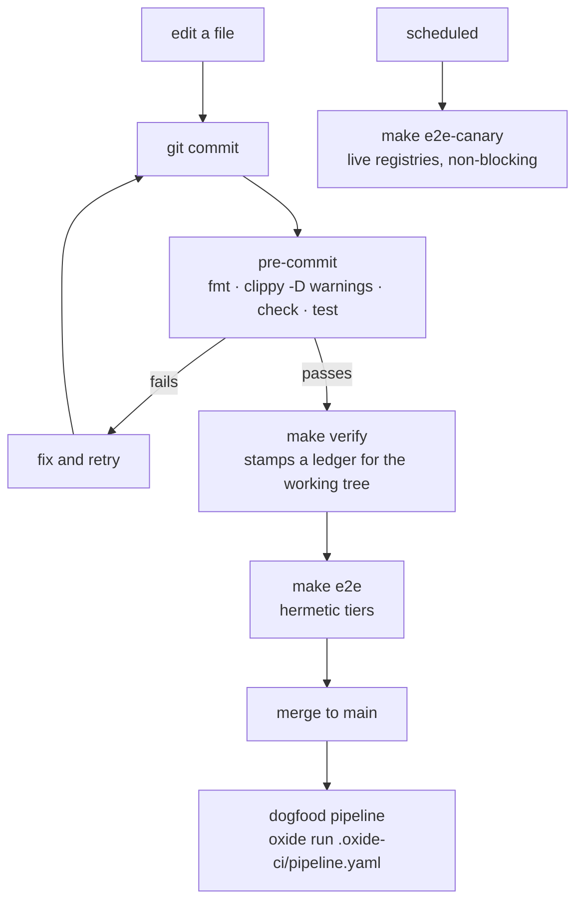
```mermaid
flowchart TD
    edit["edit a file"] --> commit["git commit"]
    commit --> pre["pre-commit<br/>fmt · clippy -D warnings · check · test"]
    pre -->|fails| fix["fix and retry"] --> commit
    pre -->|passes| gate["make verify<br/>stamps a ledger for the working tree"]
    gate --> e2etier["make e2e<br/>hermetic tiers"]
    e2etier --> merge["merge to main"]
    merge --> dog["dogfood pipeline<br/>oxide run .oxide-ci/pipeline.yaml"]
    sched["scheduled"] --> canary["make e2e-canary<br/>live registries, non-blocking"]
```

</details>

## 📚 Documentation

| | |
|---|---|
| [Local Development](docs/src/development.md) | Both dev loops, service configuration, troubleshooting |
| [System Diagrams](docs/src/diagrams.md) | The full set, with commentary |
| [Testing Strategy](docs/src/testing.md) | Tiers, what may block a merge, conventions |
| [Plugin System](docs/src/plugins.md) | Reference syntax and version semantics |
| [Architecture](ARCHITECTURE.md) | The long-form technical specification |

## 🤝 Contributing

We welcome contributions! Please see our [Contributing Guide](CONTRIBUTING.md).

Before opening a PR, `make verify` runs the same gate as pre-commit and the
dogfood pipeline — one definition of green rather than three that can disagree.

---
<div align="center">
<sub>Built with 🧡 by <a href="https://github.com/copyleftdev">Copyleft Dev</a></sub>
</div>
