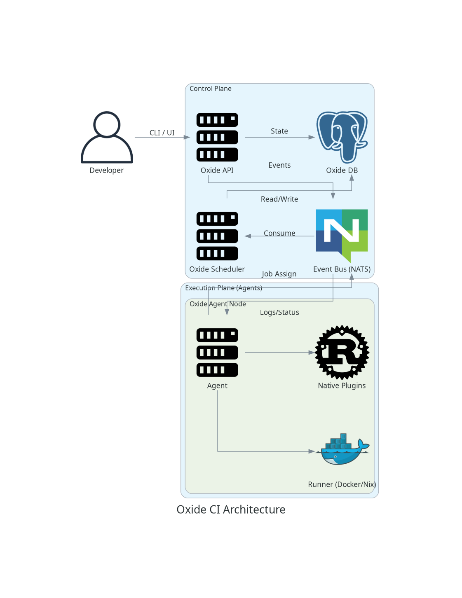

# Architecture

Oxide CI is composed of several modular crates.

## Core Components

### `oxide-core`
Defines the shared types, events, and logic used across the system. This includes the `PipelineDefinition` struct, event bus traits, and basic utilities.

### `oxide-agent`
The worker component responsible for executing jobs. It listens for commands from the scheduler and runs steps.

### `oxide-scheduler`
Orchestrates pipeline execution. It resolves the DAG (Directed Acyclic Graph) of stages and dispatches jobs to available agents.

### `oxide-runner`
The execution engine that runs individual steps. It handles:
- Docker container lifecycle (`testcontainers`, `docker`).
- Process isolation.
- Plugin execution.

## Plugins
See [Plugin System](plugins.md).

## Storage
- **PostgreSQL**: Stores pipeline definitions, run history, and logs.
- **MinIO/S3**: Stores artifacts and cache blobs.
- **NATS**: Event bus for real-time communication between components.
