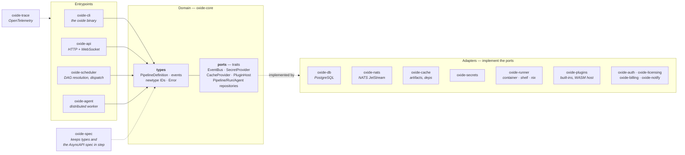
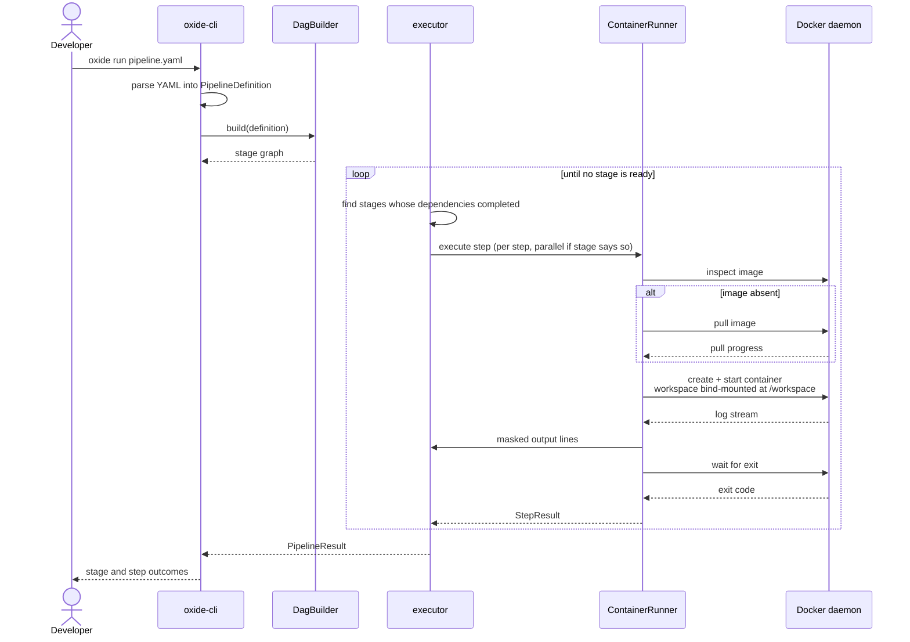
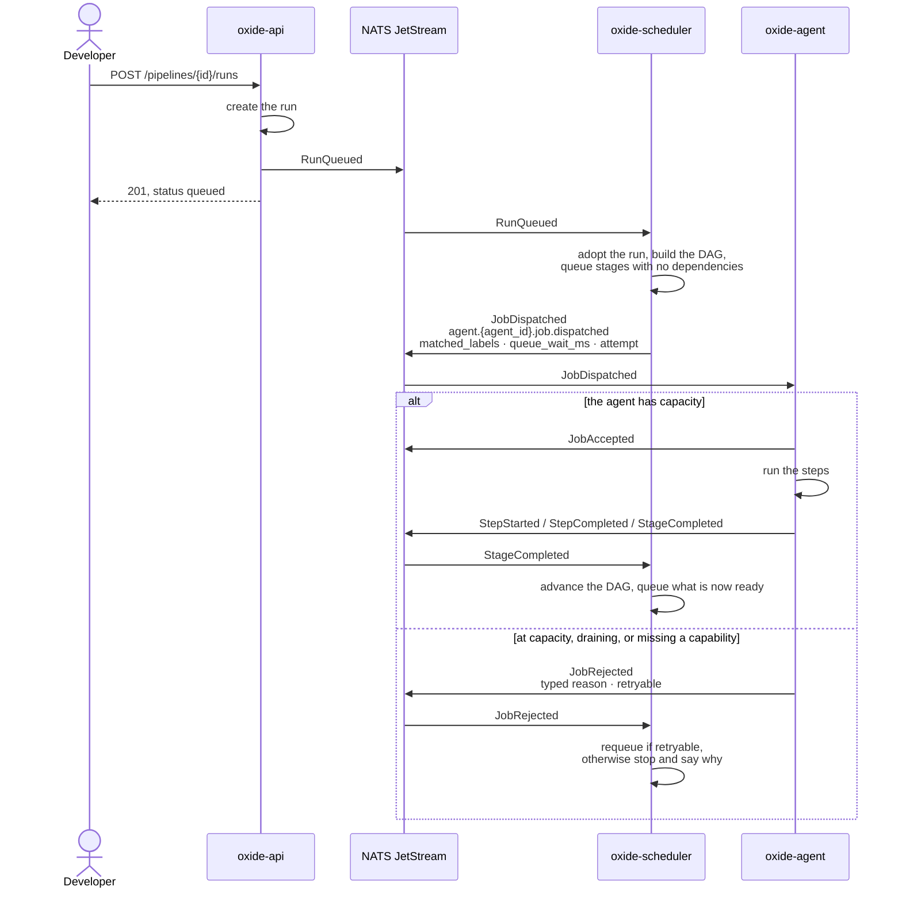
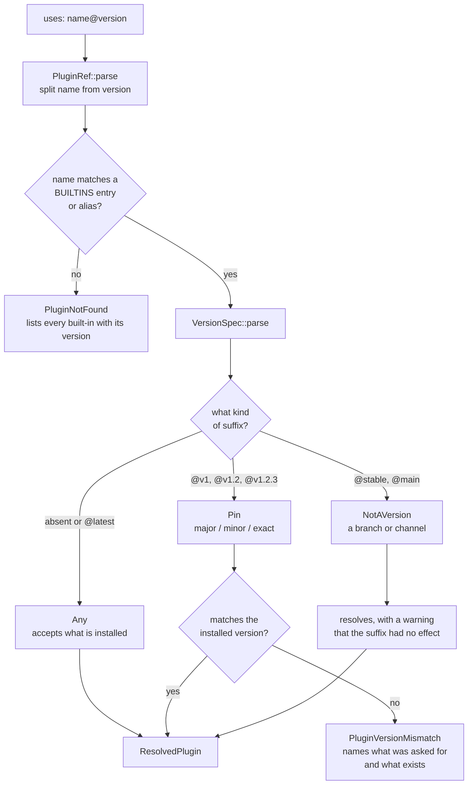
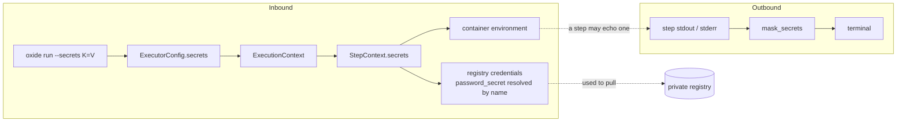
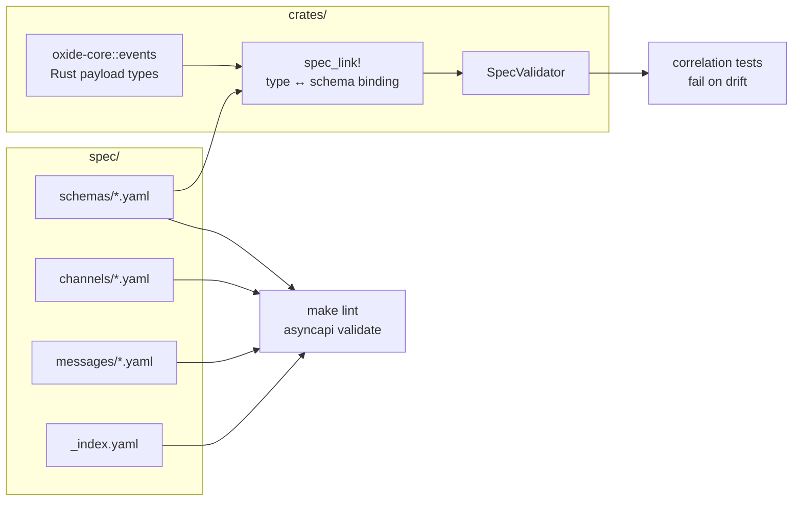
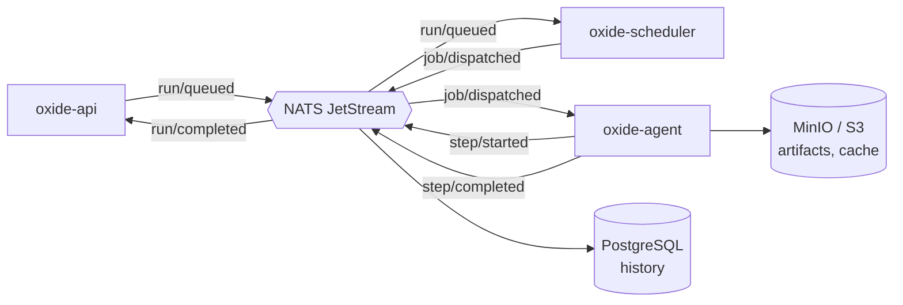

# System Diagrams

A visual tour of the ecosystem: how the crates relate, what happens when a
pipeline runs, and how references, secrets, and the spec flow through the
engine. Every diagram here describes code that exists — not a target state.

> **Rendering:** GitHub renders these natively. The mdBook build shows them as
> code blocks unless the mermaid preprocessor is installed:
> `cargo install mdbook-mermaid && mdbook-mermaid install docs`

## 1. Crate topology

Hexagonal architecture: `oxide-core` owns the domain and declares ports as
traits; adapters implement them and hold no business logic. Dependencies point
inward — nothing in `oxide-core` knows about Postgres, NATS, or Docker.

Read the dotted edges as "satisfies": the arrows in the diagram point from the
trait to its implementors, but the *dependency* points the other way. No adapter
name appears anywhere in `oxide-core`, which is the property the architecture
is protecting.

## 2. What happens when a pipeline runs

The local path, which is what `oxide run` exercises and what the end-to-end
tests assert on.

A stage failure stops the loop: stages that depend on it never run, and the
failed stage is recorded so the result says *what* failed rather than only
*that* something did.

## 2b. How a run travels the distributed system

The path a run takes when the API, scheduler and agent are running as separate
processes. Each hop is a different process, which is what makes a stall
diagnosable: the trail simply stops at whichever service is not doing its part.

The scheduler **adopts** the run rather than creating it, and deliberately
publishes nothing when it does — re-announcing a run it just heard about would
feed itself forever.

A run stuck in `queued` is almost always the second hop or the third: no
scheduler running, or no agent whose labels match.

## 3. Resolving a `uses:` reference

How `uses: docker-build@v1` becomes a plugin, and where each failure mode
diverges.

The `NotAVersion` branch is a deliberate compromise: `dtolnay/rust-toolchain@stable`
is a branch name, not a version, and pipelines ported from GitHub Actions
arrive with it. Failing would break them; ignoring it silently is what caused
[#50](https://github.com/copyleftdev/oxide-ci/issues/50). So it runs and says so.

## 4. Secrets, and where they get masked

Both the path secrets take into a step and the path their values take back out.
The masking step is not decoration: without it, delivering secrets to container
steps would turn every echoed value into a log leak.

## 5. Spec and code, kept in agreement

Event payloads have two representations. `oxide-spec` exists so they cannot
drift apart quietly.

## 6. Event flow at runtime

Distributed mode: components communicate over NATS JetStream using the event
shapes the spec defines.

## See also

- [Testing Strategy](testing.md) — the tiers, and which of them can block a merge
- [Plugin System](plugins.md) — reference syntax and version semantics
- [Crate Ecosystem](crates.md) — what each crate is responsible for
