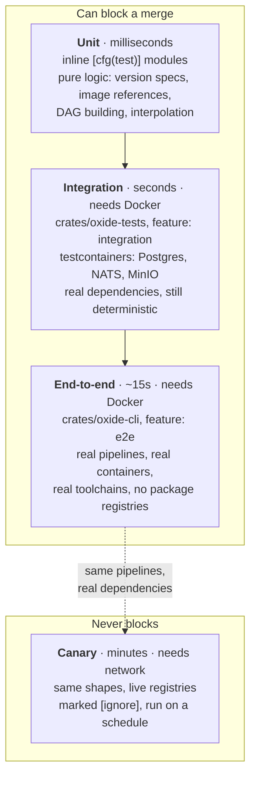
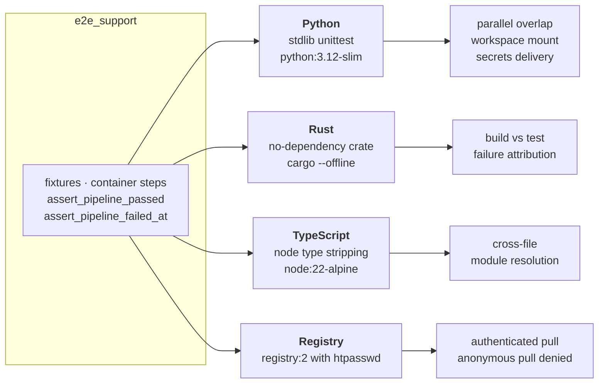
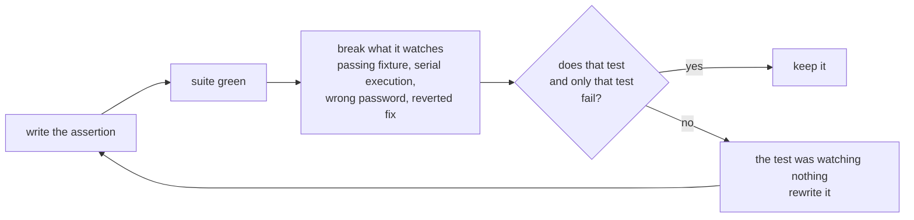
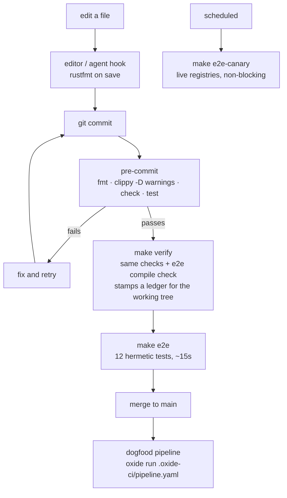

# Testing Strategy

Four tiers, distinguished by one question: **what is allowed to turn the gate
red?** A gate that fails for reasons outside the repository trains people to
ignore it, so the tiers that block are exactly the tiers that are hermetic.

## 1. The tiers

The canary tier exists because the question *"does Oxide still work against a
live PyPI, crates.io, and npm?"* is worth answering daily and worth **nobody's**
merge being blocked on. An upstream outage is information, not a defect in this
repository.

## 2. What the end-to-end tier proves

Unit tests prove the DAG builder orders stages. End-to-end tests prove the
engine *ran* them in that order, in a container, against a real toolchain, and
reported the truth about what happened.

Each ecosystem covers what is specific to its toolchain. Engine-level behavior —
parallel overlap, the workspace bind mount — is asserted once, in the Python
slice, rather than repeated three times for no extra information.

**Hermetic means hermetic.** Python runs stdlib `unittest` with no `pip
install`. Rust builds a dependency-free crate with `--offline`. TypeScript runs
`.ts` directly through Node's built-in type stripping, so there is no `npm
install`. None of the blocking tiers can be broken by a package registry.

## 3. Every negative test is mutation-tested

A test that cannot fail is worse than no test, because it reports safety it
does not provide. So each failure-path assertion is verified by breaking the
thing it watches and confirming it notices.

Mutations that have been run against this suite: flipping a failing fixture to
passing, setting `parallel: true` to `false`, supplying the wrong registry
password, and reverting the secrets-plumbing fix. In each case exactly the
corresponding test failed.

## 4. When each tier runs

`make verify` is the single definition of the gate. `.pre-commit-config.yaml`
and `.oxide-ci/pipeline.yaml` run the same checks, so there is one answer to
"is this green?" rather than three that can disagree.

## 5. Commands

| Intent | Command |
|---|---|
| Full gate before calling something done | `make verify` |
| Fast inner loop | `cargo check -p <crate>` |
| Unit tests only | `cargo test --workspace --lib --bins` |
| Integration tests (Docker) | `cargo test -p oxide-tests --features integration` |
| End-to-end (Docker, minutes on a cold image cache) | `make e2e` |
| Canary against live registries | `make e2e-canary` |
| Validate the AsyncAPI spec | `make lint` |

`--lib --bins` matters: `oxide-cli` is a bin-only crate, so `--lib` alone
silently skips every test in it.

## 6. Conventions

- Unit tests live beside the code in `#[cfg(test)] mod tests`.
- Cross-crate tests live in `crates/oxide-tests/tests/`.
- Use `wiremock` for external HTTP and `testcontainers` for real services.
  Never mock `oxide-core` types — implement the port trait as a test double.
- Test the error path, not only the happy path. A test that can only pass is
  not evidence.
- Fixtures that a test generates belong in a tempdir, not in the repository.

## See also

- [System Diagrams](diagrams.md) — how the pieces fit together
- [Contributing](contributing.md) — workflow and commit conventions
